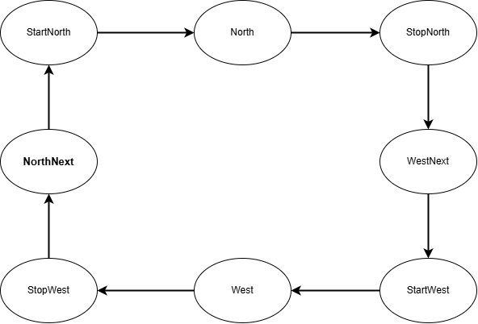

# Traffic Light Module

This project describes a simple traffic light module implemented in VHDL. The module controls the lights for a four-way intersection, with North/South and West/East directions.

## Features

* Implements a basic traffic light sequence:
    * Red in all directions for 5 seconds.
    * North/South: Red + Yellow for 5 seconds, Green for 60 seconds, Yellow for 5 seconds.
    * West/East: Red for 70 seconds, Red + Yellow for 5 seconds, Green for 60 seconds, Yellow for 5 seconds.
* Clock-driven operation.
* Negative reset (`nRst`).
* Configurable clock frequency using a generic.

## Module Architecture

The `TrafficLight` entity has the following ports:

* `Clk`: Clock input.
* `nRst`: Negative reset input.
* `NorthRed`, `NorthYellow`, `NorthGreen`: Outputs for the North/South traffic lights.
* `WestRed`, `WestYellow`, `WestGreen`: Outputs for the West/East traffic lights.

The `rtl` architecture implements a state machine with the following states:

* `NorthNext`: All lights are Red.
* `StartNorth`: North/South: Red + Yellow, West/East: Red.
* `North`: North/South: Green, West/East: Red.
* `StopNorth`: North/South: Yellow, West/East: Red.
* `WestNext`: All lights are Red.
* `StartWest`: West/East: Red + Yellow, North/South: Red
* `West`: West/East: Green, North/South: Red.
* `StopWest`: West/East: Yellow, North/South: Red.

The state machine uses a counter to control the duration of each state. The `CounterVal` function calculates the number of clock cycles for a given time in minutes and seconds.  The `CounterExpired` impure function checks if the counter has reached the target value.

## Testbench

The provided testbench (`TrafficLightTB`) simulates the `TrafficLight` module. It:

* Defines the clock frequency.
* Generates a clock signal.
* Applies a reset signal.
* Verifies the basic operation of the traffic light sequence.

## State Diagram

